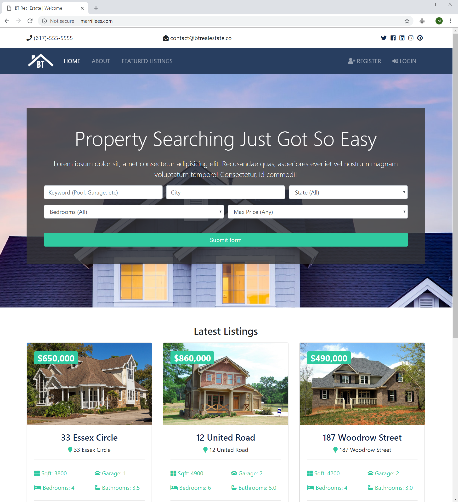
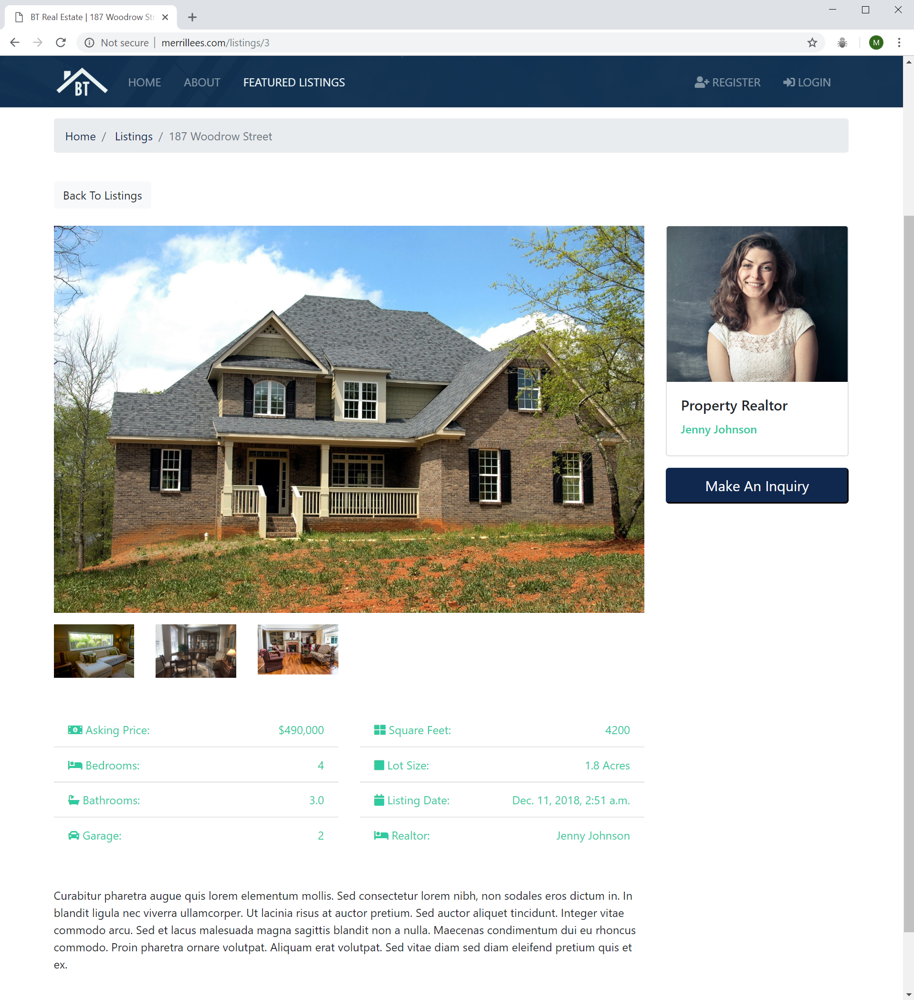

# Real estate website with Python and django
## Practice project to learn python and django - check it out: [merrillees.com](http://merrillees.com/) 
### A follow along project from an [online course](https://www.udemy.com/python-django-dev-to-deployment)

### Useful cli and django commands:
- **source ./venv/bin/activate** from the workspace folder to activate the virtual environment
- **deactivate** while in the virtual environment to exit the virtual environment
- **python manage.py runserver** to run the server
- **python manage.py createstatic** to create the static files from **btre/static**
- **python manage.py startapp pages** to create a new pages app
- **python manage.py makemigrations** to create migration files
- **python manage.py migrate** to migrate
 

### Screenshots of the website:
#### Home page

 
 

#### Listing

